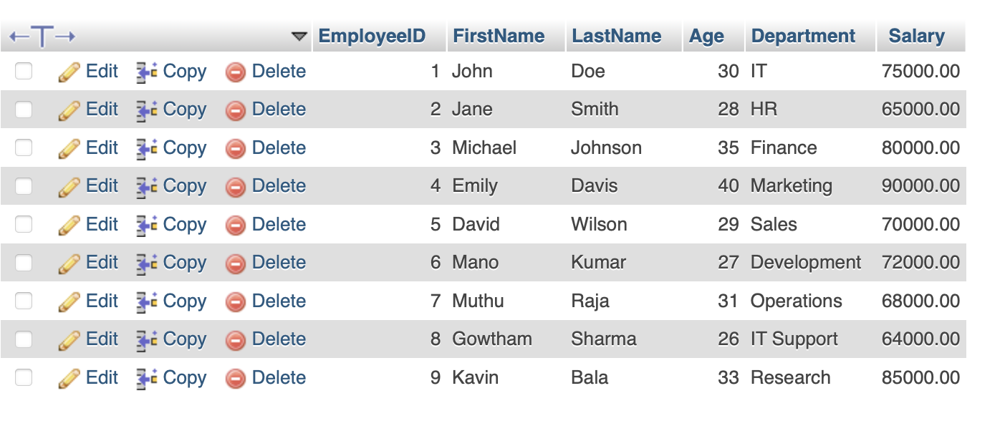

### 1. Create the Table
Run the following SQL command to create the `Employees` table with appropriate columns:

```sql
CREATE TABLE Employees (
    EmployeeID INT PRIMARY KEY,
    FirstName VARCHAR(50),
    LastName VARCHAR(50),
    Age INT,
    Department VARCHAR(50),
    Salary DECIMAL(10,2)
);
```

### 2. Insert Sample Data
Use the following `INSERT` statement to populate the table with sample records:

```sql
INSERT INTO Employees (EmployeeID, FirstName, LastName, Age, Department, Salary)
VALUES
(1, 'John', 'Doe', 30, 'IT', 75000.00),
(2, 'Jane', 'Smith', 28, 'HR', 65000.00),
(3, 'Michael', 'Johnson', 35, 'Finance', 80000.00),
(4, 'Emily', 'Davis', 40, 'Marketing', 90000.00),
(5, 'David', 'Wilson', 29, 'Sales', 70000.00),
(6, 'Mano', 'Kumar', 27, 'Development', 72000.00),
(7, 'Muthu', 'Raja', 31, 'Operations', 68000.00),
(8, 'Gowtham', 'Sharma', 26, 'IT Support', 64000.00),
(9, 'Kavin', 'Bala', 33, 'Research', 85000.00);
```

### 3. Retrieve Data
To view the inserted records, execute:

```sql
SELECT * FROM Employees;
```

## Output



