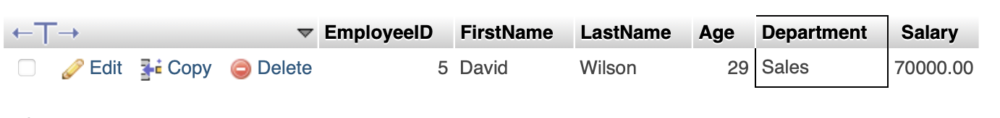
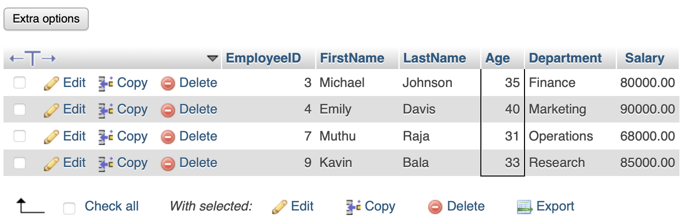
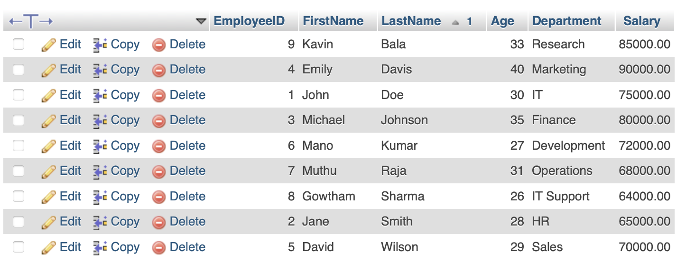
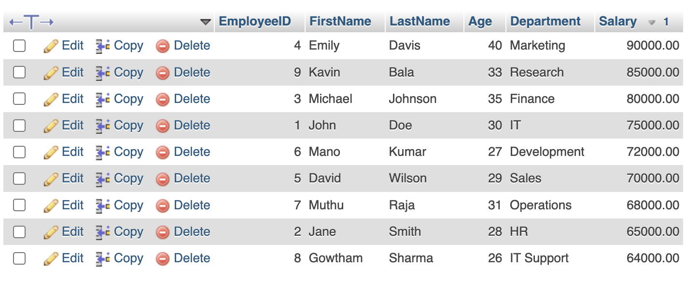
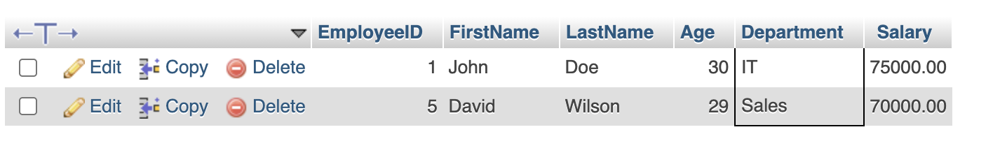

- **Filter by Department (Sales):**
  ```sql
  SELECT * FROM Employees WHERE Department = 'Sales';
  ```
## Output

- **Filter by Age (Employees older than 30):**
  ```sql
  SELECT * FROM Employees WHERE Age > 30;
  ```
## Output

- **Sort by Last Name (Ascending):**
  ```sql
  SELECT * FROM Employees ORDER BY LastName ASC;
  ```
## Output

- **Sort by Salary (Descending):**
  ```sql
  SELECT * FROM Employees ORDER BY Salary DESC;
  ```
## Output

- **Filter with Multiple Conditions (Age > 30 AND Salary > 70000):**
  ```sql
  SELECT * FROM Employees WHERE Age > 30 AND Salary > 70000;
  ```
## Output


