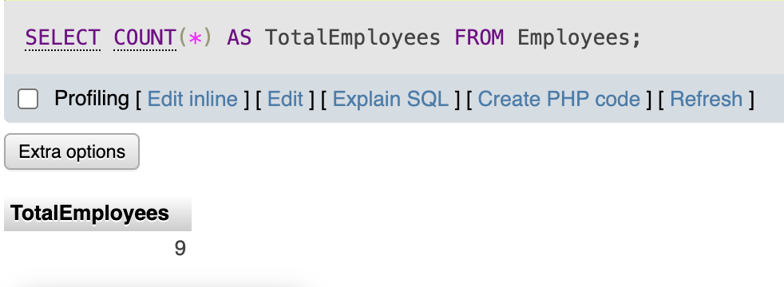
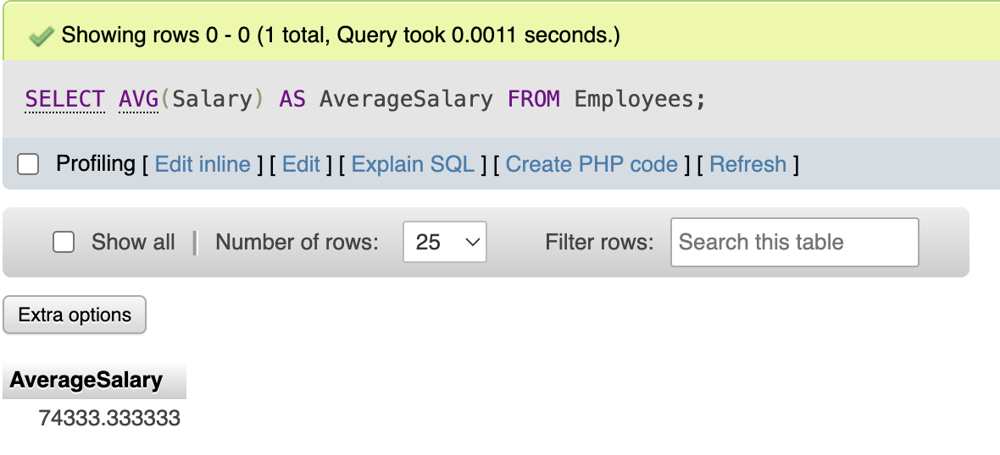
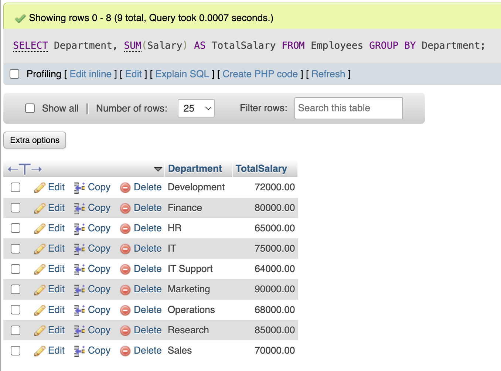
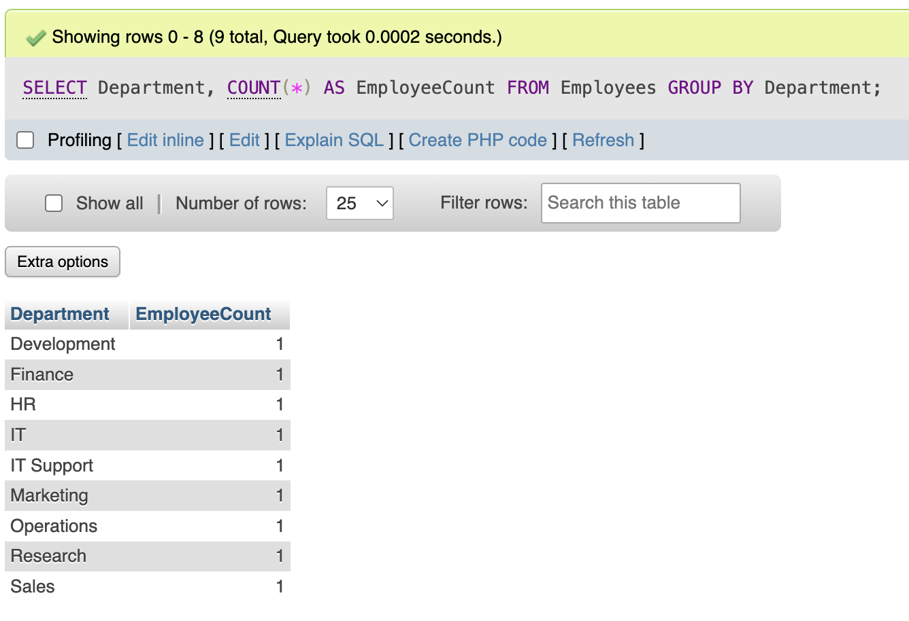
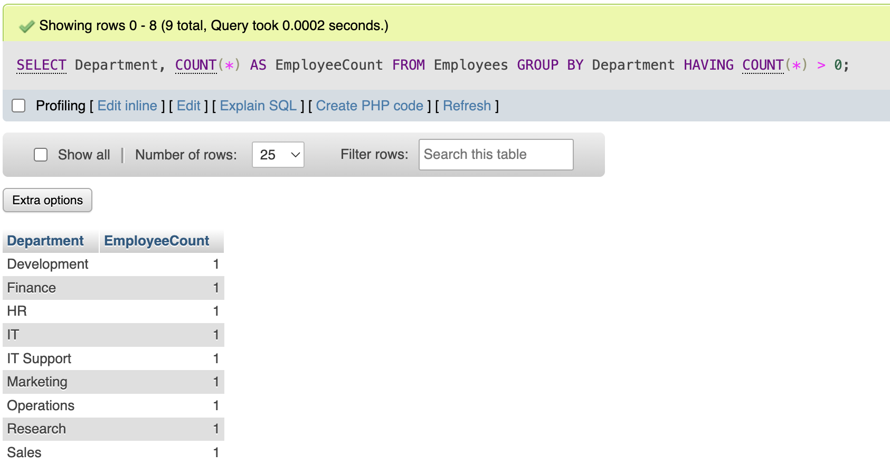

- **Count the total number of employees:**
  ```sql
  SELECT COUNT(*) AS TotalEmployees FROM Employees;
  ```
  ## Output
  

- **Calculate the average salary of all employees:**
  ```sql
  SELECT AVG(Salary) AS AverageSalary FROM Employees;
  ```
  ## Output
  

- **Total salary expense per department:**
  ```sql
  SELECT Department, SUM(Salary) AS TotalSalary FROM Employees GROUP BY Department;
  ```
  ## Output
  

- **Count the number of employees per department:**
  ```sql
  SELECT Department, COUNT(*) AS EmployeeCount FROM Employees GROUP BY Department;
  ```
  ## Output
  

- **Filter grouped results (departments with more than 1 employee):**
  ```sql
  SELECT Department, COUNT(*) AS EmployeeCount FROM Employees GROUP BY Department HAVING COUNT(*) > 1;
  ```
  ## Output
  


