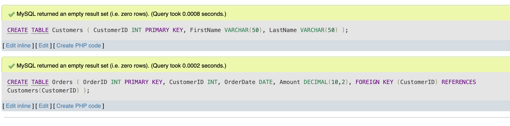
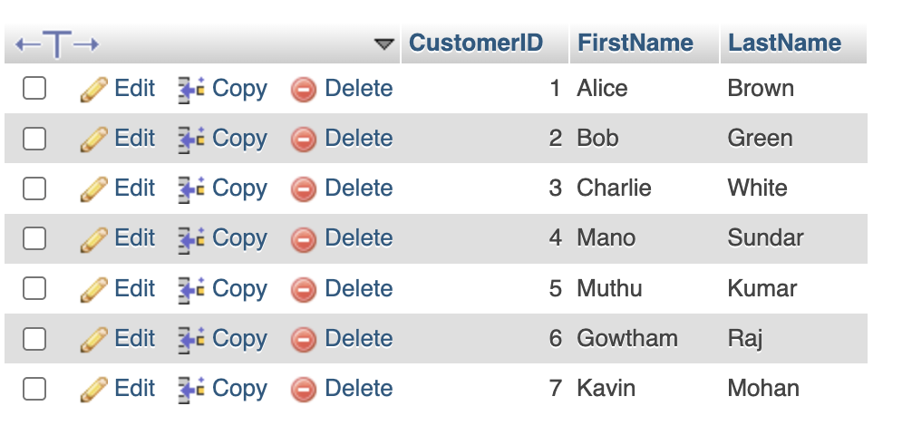
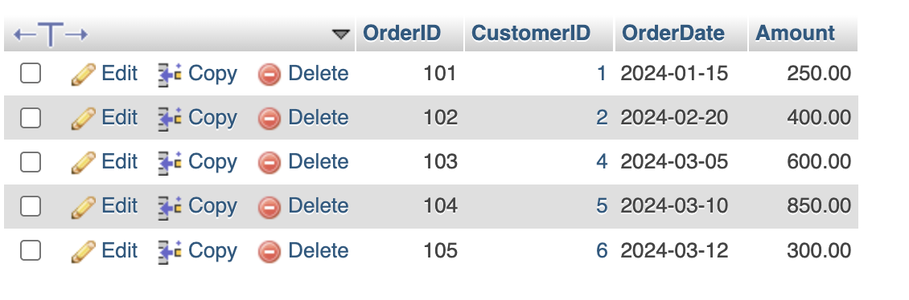
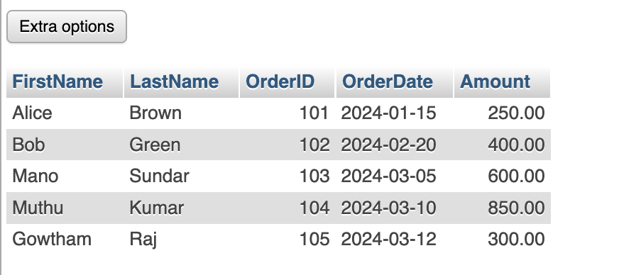
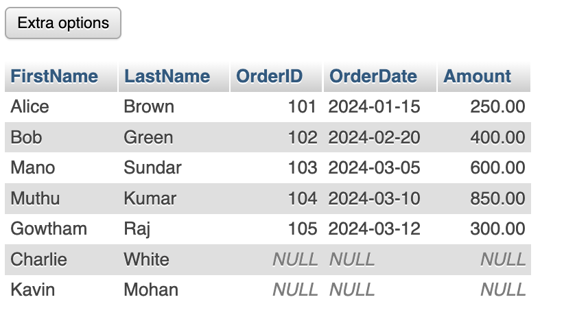

### **1. Creating Related Tables**
We need two tables:
- **Customers** (stores customer details)
- **Orders** (tracks purchases, linked to `Customers` via `CustomerID`)

```sql
CREATE TABLE Customers (
    CustomerID INT PRIMARY KEY,
    FirstName VARCHAR(50),
    LastName VARCHAR(50)
);


CREATE TABLE Orders (
    OrderID INT PRIMARY KEY,
    CustomerID INT,
    OrderDate DATE,
    Amount DECIMAL(10,2),
    FOREIGN KEY (CustomerID) REFERENCES Customers(CustomerID)
);
```

  ## Output
  

---

### **2. Inserting Sample Data**  

```sql
INSERT INTO Customers (CustomerID, FirstName, LastName) VALUES
(1, 'Alice', 'Brown'),
(2, 'Bob', 'Green'),
(3, 'Charlie', 'White'),
(4, 'Mano', 'Sundar'),
(5, 'Muthu', 'Kumar'),
(6, 'Gowtham', 'Raj'),
(7, 'Kavin', 'Mohan');

INSERT INTO Orders (OrderID, CustomerID, OrderDate, Amount) VALUES
(101, 1, '2024-01-15', 250.00),
(102, 2, '2024-02-20', 400.00),
(103, 4, '2024-03-05', 600.00),
(104, 5, '2024-03-10', 850.00),
(105, 6, '2024-03-12', 300.00);
```

---
## Output
  

## Output
  

#### **INNER JOIN** (Only Matching Records)  

```sql
SELECT Customers.FirstName, Customers.LastName, Orders.OrderID, Orders.OrderDate, Orders.Amount
FROM Customers
INNER JOIN Orders ON Customers.CustomerID = Orders.CustomerID;
```

**Returns only customers who have placed an order.**  
**Customers without orders are excluded.**  

| FirstName | LastName  | OrderID | OrderDate  | Amount  |  
|-----------|----------|--------|------------|---------|  
| Alice     | Brown    | 101    | 2024-01-15 | 250.00  |  
| Bob       | Green    | 102    | 2024-02-20 | 400.00  |  
| Mano      | Sundar   | 103    | 2024-03-05 | 600.00  |  
| Muthu     | Kumar    | 104    | 2024-03-10 | 850.00  |  
| Gowtham   | Raj      | 105    | 2024-03-12 | 300.00  |  

---

  ## Output
  

#### **LEFT JOIN** (All Customers, Even Without Orders)  

```sql
SELECT Customers.FirstName, Customers.LastName, Orders.OrderID, Orders.OrderDate, Orders.Amount
FROM Customers
LEFT JOIN Orders ON Customers.CustomerID = Orders.CustomerID;
```

**Returns all customers.**  
**If a customer has no order, order details will be NULL.**  

| FirstName | LastName  | OrderID | OrderDate  | Amount  |  
|-----------|----------|--------|------------|---------|  
| Alice     | Brown    | 101    | 2024-01-15 | 250.00  |  
| Bob       | Green    | 102    | 2024-02-20 | 400.00  |  
| Charlie   | White    | NULL   | NULL       | NULL    |  
| Mano      | Sundar   | 103    | 2024-03-05 | 600.00  |  
| Muthu     | Kumar    | 104    | 2024-03-10 | 850.00  |  
| Gowtham   | Raj      | 105    | 2024-03-12 | 300.00  |  
| Kavin     | Mohan    | NULL   | NULL       | NULL    |  

---

  ## Output
  

**INNER JOIN** → Only customers **with orders** are included.  
**LEFT JOIN** → **All customers** are included, even those **without orders** (NULL values appear for them).  

---
