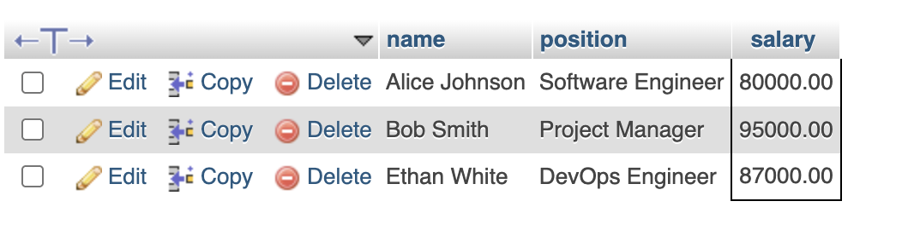
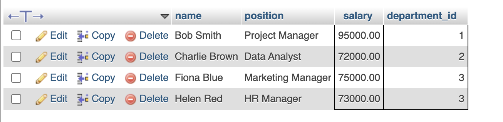
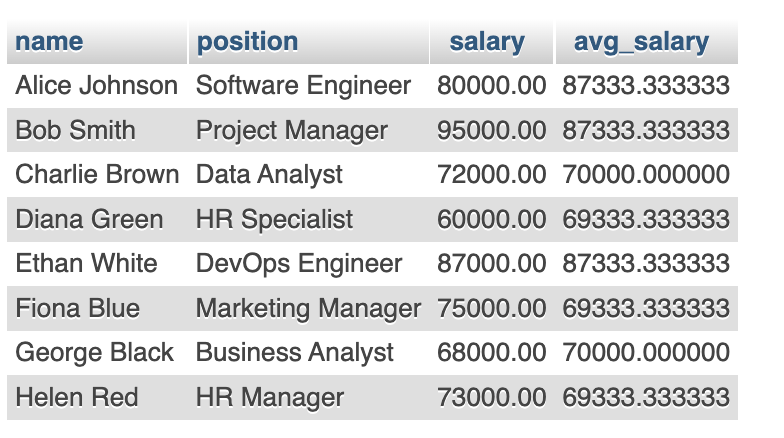

## Types of Subqueries

### 1. Non-Correlated Subquery
- Executes independently before the main query runs.
- Example: Getting employees earning more than the company’s average salary.

### 2. Correlated Subquery
- Depends on the outer query and runs for each row in the main query.
- Example: Getting employees earning more than the average salary of their department.

---

## Step 1: Creating the Employees Table


```sql
CREATE TABLE Employees (
    id INT PRIMARY KEY AUTO_INCREMENT,
    name VARCHAR(100) NOT NULL,
    position VARCHAR(50) NOT NULL,
    salary DECIMAL(10,2) NOT NULL,
    department_id INT NOT NULL,
    hire_date DATE NOT NULL
);
```

---

## Step 2: Inserting Sample Data

```sql
INSERT INTO Employees (name, position, salary, department_id, hire_date) VALUES
('Alice Johnson', 'Software Engineer', 80000, 1, '2022-06-15'),
('Bob Smith', 'Project Manager', 95000, 1, '2021-03-22'),
('Charlie Brown', 'Data Analyst', 72000, 2, '2023-01-10'),
('Diana Green', 'HR Specialist', 60000, 3, '2020-07-30'),
('Ethan White', 'DevOps Engineer', 87000, 1, '2019-11-05'),
('Fiona Blue', 'Marketing Manager', 75000, 3, '2023-05-18'),
('George Black', 'Business Analyst', 68000, 2, '2022-08-25'),
('Helen Red', 'HR Manager', 73000, 3, '2021-12-10');
```

---

## Step 3: Non-Correlated Subquery

### Find Employees Who Earn More Than the Average Salary
```sql
SELECT name, position, salary 
FROM Employees
WHERE salary > (SELECT AVG(salary) FROM Employees);
```

Explanation:
- `(SELECT AVG(salary) FROM Employees)` calculates the average salary.
- The main query selects employees earning more than this value.

---

  ## Output
  

## Step 4: Correlated Subquery

### Find Employees Who Earn More Than Their Department's Average Salary
```sql
SELECT name, position, salary, department_id
FROM Employees e1
WHERE salary > (
    SELECT AVG(salary) 
    FROM Employees e2 
    WHERE e1.department_id = e2.department_id
);
```

Explanation:
- The subquery computes the average salary per department.
- The main query selects employees earning more than their department’s average.

---

  ## Output
  

## Step 5: Subquery in the SELECT Clause

### Show Each Employee Along with the Company-Wide Average Salary
```sql
SELECT name, position, salary, 
       (SELECT AVG(salary) FROM Employees) AS avg_salary
FROM Employees;
```

Explanation:
- The subquery calculates the company-wide average salary.
- It is displayed as a computed column (`avg_salary`).

---

  ## Output
  

## Step 6: Subquery in the FROM Clause (Using a Virtual Table)

### List Employees with Their Department’s Average Salary
```sql
SELECT e.name, e.position, e.salary, d.avg_salary
FROM Employees e
JOIN (
    SELECT department_id, AVG(salary) AS avg_salary
    FROM Employees
    GROUP BY department_id
) d ON e.department_id = d.department_id;
```

Explanation:
- The subquery (`d`) calculates the average salary per department.
- The main query joins `Employees` with this result using `department_id`.

---

  ## Output
  

## Final Recap
| Concept | Example |
|---------|---------|
| Non-Correlated Subquery | Employees earning more than the company-wide average. |
| Correlated Subquery | Employees earning more than their department’s average. |
| Subquery in SELECT Clause | Display each employee with the average salary. |
| Subquery in FROM Clause | Create a temporary table to store department-wise averages. |

---


