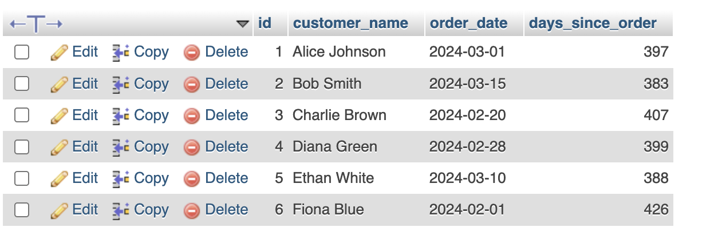
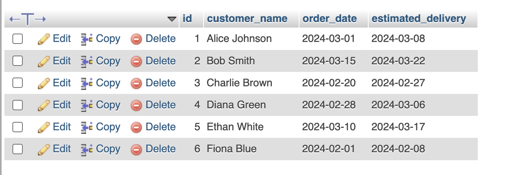
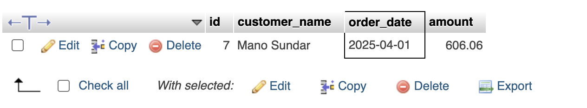
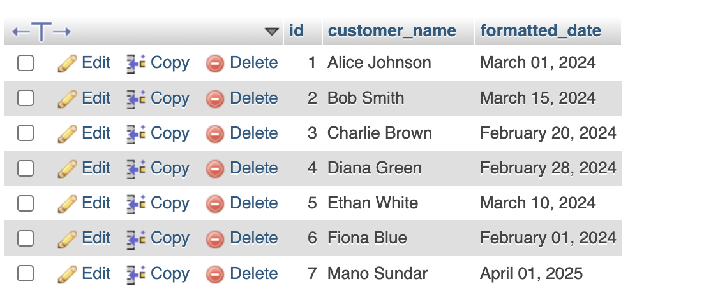

## Creating a Sample Table
We will create an `Orders` table with fields:
- `id` (Primary Key)
- `customer_name` (Name of the customer)
- `order_date` (Date when the order was placed)
- `amount` (Total order value)

```sql
CREATE TABLE Orders (
    id INT PRIMARY KEY AUTO_INCREMENT,
    customer_name VARCHAR(100) NOT NULL,
    order_date DATE NOT NULL,
    amount DECIMAL(10,2) NOT NULL
);
```

---

## Inserting Sample Data
```sql
INSERT INTO Orders (customer_name, order_date, amount) VALUES
('Alice Johnson', '2024-03-01', 250.75),
('Bob Smith', '2024-03-15', 320.50),
('Charlie Brown', '2024-02-20', 150.00),
('Diana Green', '2024-02-28', 500.00),
('Ethan White', '2024-03-10', 275.30),
('Fiona Blue', '2024-02-01', 600.90);
```

---

## Using Date Functions

### 1. Calculating the Difference Between Two Dates (`DATEDIFF`)
#### Example: Find the number of days since an order was placed.
```sql
SELECT id, customer_name, order_date,
       DATEDIFF(CURDATE(), order_date) AS days_since_order
FROM Orders;
```
**Explanation:**
- `CURDATE()` returns the current date.
- `DATEDIFF(CURDATE(), order_date)` calculates the difference in days between today and the `order_date`.

---


  ## Output
  


### 2. Adding Days to a Date (`DATE_ADD` or `DATEADD`)
#### Example: Predict the estimated delivery date (7 days after order).
```sql
SELECT id, customer_name, order_date,
       DATE_ADD(order_date, INTERVAL 7 DAY) AS estimated_delivery
FROM Orders;
```
**Explanation:**
- `DATE_ADD(order_date, INTERVAL 7 DAY)` adds 7 days to `order_date`, estimating the delivery date.
- In SQL Server, use `DATEADD(DAY, 7, order_date)` instead.

---


  ## Output
  


### 3. Filtering Records Within a Date Range
#### Example: Retrieve orders placed in the last 30 days.
```sql
SELECT id, customer_name, order_date, amount
FROM Orders
WHERE order_date >= DATE_SUB(CURDATE(), INTERVAL 30 DAY);
```
**Explanation:**
- `DATE_SUB(CURDATE(), INTERVAL 30 DAY)` calculates the date 30 days before today.
- The query selects orders where `order_date` is within this period.
- In SQL Server, use `DATEADD(DAY, -30, GETDATE())` instead.

---


  ## Output
  


### 4. Formatting Date Outputs (`DATE_FORMAT`, `TO_CHAR`)
#### Example: Display the order date in `Month DD, YYYY` format.
```sql
SELECT id, customer_name,
       DATE_FORMAT(order_date, '%M %d, %Y') AS formatted_date
FROM Orders;
```
**Explanation:**
- `DATE_FORMAT(order_date, '%M %d, %Y')` formats the date as `March 01, 2024`.
- In PostgreSQL, use `TO_CHAR(order_date, 'Month DD, YYYY')`.

---


  ## Output
  


## Summary Table
| Function | Purpose | Example Usage |
|----------|---------|---------------|
| `DATEDIFF(date1, date2)` | Get the number of days between two dates | Days since an order was placed |
| `DATE_ADD(date, INTERVAL X DAY)` | Add days to a date | Calculate estimated delivery date |
| `DATE_SUB(date, INTERVAL X DAY)` | Subtract days from a date | Find orders from the last 30 days |
| `DATE_FORMAT(date, format)` | Format date output | Convert date to readable format |

---

## Conclusion
Date and time functions are crucial for handling and analyzing time-sensitive data. Understanding how to manipulate and format date values improves data retrieval and reporting efficiency.

Let me know if you need further clarifications or additional examples.

