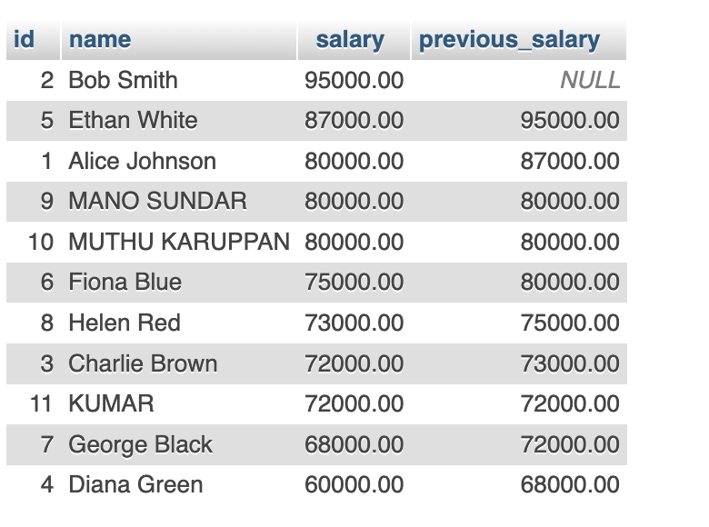

### Key Concepts:
- **`PARTITION BY`**: Divides the data into partitions (subsets) for computations.
- **`ORDER BY`**: Defines the order within each partition.
- **Frame Specification**: Determines how many rows to consider in calculations.

---

## Step 1: Creating the Employees Table
We will create an `Employees` table with fields:
- `id` (Primary Key)
- `name` (Employee's name)
- `department_id` (Department ID the employee belongs to)
- `salary` (Employee’s salary)
- `hire_date` (Date the employee was hired)

```sql
CREATE TABLE Employees (
    id INT PRIMARY KEY AUTO_INCREMENT,
    name VARCHAR(100) NOT NULL,
    department_id INT NOT NULL,
    salary DECIMAL(10,2) NOT NULL,
    hire_date DATE NOT NULL
);
```

---

## Step 2: Inserting Sample Data
```sql
INSERT INTO Employees (name, department_id, salary, hire_date) VALUES
('Alice Johnson', 1, 80000, '2020-06-15'),
('Bob Smith', 1, 95000, '2018-03-22'),
('Charlie Brown', 2, 72000, '2021-01-10'),
('Diana Green', 2, 60000, '2019-07-30'),
('Ethan White', 1, 87000, '2017-11-05'),
('Fiona Blue', 3, 75000, '2023-05-18'),
('George Black', 3, 68000, '2022-08-25'),
('Helen Red', 3, 73000, '2021-12-10');
```

---

## Step 3: Ranking Employees by Salary
### 1. Using `ROW_NUMBER()`
Assigns a unique rank to each row within a department, without skipping numbers.
```sql
SELECT id, name, department_id, salary,
       ROW_NUMBER() OVER(PARTITION BY department_id ORDER BY salary DESC) AS row_num
FROM Employees;
```
**Explanation:**
- `PARTITION BY department_id` groups employees by department.
- `ORDER BY salary DESC` orders salaries in descending order.
- `ROW_NUMBER()` assigns a unique rank, restarting for each department.

## Output
  

### 2. Using `RANK()`
Assigns a ranking number but leaves gaps when there are salary ties.
```sql
SELECT id, name, department_id, salary,
       RANK() OVER(PARTITION BY department_id ORDER BY salary DESC) AS rank_num
FROM Employees;
```
**Example Result:**
| Name       | Department | Salary | Rank |
|------------|-----------|--------|------|
| Bob Smith | 1         | 95000  | 1    |
| Ethan White | 1       | 87000  | 2    |
| Alice Johnson | 1      | 80000  | 3    |
| Charlie Brown | 2      | 72000  | 1    |
| Diana Green | 2       | 60000  | 2    |

## Output
  

### 3. Using `DENSE_RANK()`
Ranks without skipping numbers when salaries are tied.
```sql
SELECT id, name, department_id, salary,
       DENSE_RANK() OVER(PARTITION BY department_id ORDER BY salary DESC) AS dense_rank_num
FROM Employees;
```
**Difference Between `RANK()` and `DENSE_RANK()`:**
- `RANK()` skips numbers for ties.
- `DENSE_RANK()` does not skip numbers.

---

## Output
  

## Step 4: Using `LEAD()` and `LAG()`
### 1. Using `LEAD()` to Get Next Employee’s Salary
```sql
SELECT id, name, salary,
       LEAD(salary) OVER(ORDER BY salary DESC) AS next_highest_salary
FROM Employees;
```
**Explanation:**
- `LEAD(salary)` retrieves the salary from the next row in order.

## Output
  

### 2. Using `LAG()` to Get Previous Employee’s Salary
```sql
SELECT id, name, salary,
       LAG(salary) OVER(ORDER BY salary DESC) AS previous_salary
FROM Employees;
```
**Explanation:**
- `LAG(salary)` retrieves the salary from the previous row.

---

## Output
  

## Summary Table
| Function | Purpose | Example |
|----------|---------|---------|
| `ROW_NUMBER()` | Assigns a unique number to each row in a partition | Rank employees without gaps |
| `RANK()` | Assigns a ranking number but leaves gaps for ties | Rank employees by salary with gaps |
| `DENSE_RANK()` | Assigns ranks without skipping numbers | Rank employees by salary without gaps |
| `LEAD()` | Retrieves the next row’s value | Get the next highest salary |
| `LAG()` | Retrieves the previous row’s value | Get the previous employee’s salary |

---

