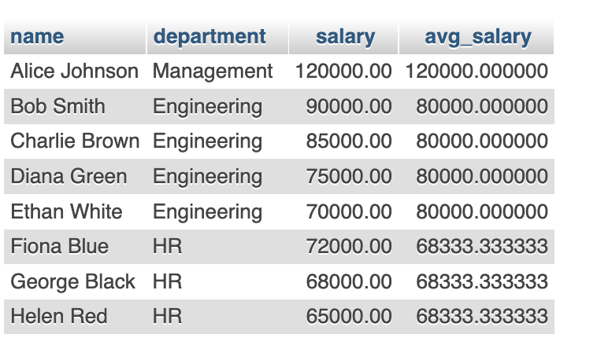
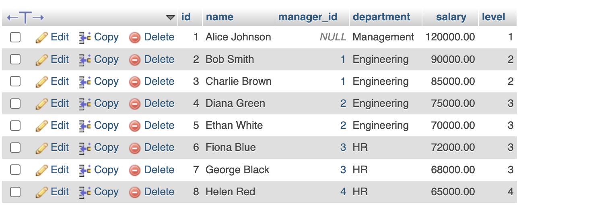

- **Non-recursive CTE**: Used for readability and simplifying queries.
- **Recursive CTE**: Used to process hierarchical data, with proper termination to avoid infinite loops.

---

## Step 1: Creating the Employees Table
We will create an `Employees` table with fields:
- `id` (Primary Key)
- `name` (Employee's name)
- `manager_id` (ID of the manager, null if top-level employee)
- `department` (Department the employee belongs to)
- `salary` (Employee’s salary)

```sql
CREATE TABLE Employees (
    id INT PRIMARY KEY AUTO_INCREMENT,
    name VARCHAR(100) NOT NULL,
    manager_id INT NULL,
    department VARCHAR(100) NOT NULL,
    salary DECIMAL(10,2) NOT NULL,
    FOREIGN KEY (manager_id) REFERENCES Employees(id)
);
```

---

## Step 2: Inserting Sample Data
```sql
INSERT INTO Employees (id, name, manager_id, department, salary) VALUES
(1, 'Alice Johnson', NULL, 'Management', 120000),
(2, 'Bob Smith', 1, 'Engineering', 90000),
(3, 'Charlie Brown', 1, 'Engineering', 85000),
(4, 'Diana Green', 2, 'Engineering', 75000),
(5, 'Ethan White', 2, 'Engineering', 70000),
(6, 'Fiona Blue', 3, 'HR', 72000),
(7, 'George Black', 3, 'HR', 68000),
(8, 'Helen Red', 4, 'HR', 65000);
```

---

## Step 3: Using a Non-Recursive CTE
A non-recursive CTE improves readability by breaking down complex queries.

### Example: Calculating Average Salary Per Department
```sql
WITH DepartmentSalary AS (
    SELECT department, AVG(salary) AS avg_salary
    FROM Employees
    GROUP BY department
)
SELECT e.name, e.department, e.salary, d.avg_salary
FROM Employees e
JOIN DepartmentSalary d ON e.department = d.department;
```
## Output
  
**Explanation:**
- The `DepartmentSalary` CTE calculates the average salary per department.
- The main query joins it with the `Employees` table to display each employee’s salary along with the department’s average salary.

---

## Step 4: Using a Recursive CTE for Hierarchical Data
Recursive CTEs help navigate hierarchical relationships, such as an organizational chart.

### Example: Displaying Employee Hierarchy
```sql
WITH RECURSIVE EmployeeHierarchy AS (
    -- Base Case: Select top-level managers
    SELECT id, name, manager_id, department, salary, 1 AS level
    FROM Employees
    WHERE manager_id IS NULL
    
    UNION ALL
    
    -- Recursive Case: Join employees with their managers
    SELECT e.id, e.name, e.manager_id, e.department, e.salary, eh.level + 1
    FROM Employees e
    JOIN EmployeeHierarchy eh ON e.manager_id = eh.id
)
SELECT * FROM EmployeeHierarchy ORDER BY level, manager_id;
```
## Output
  
**Explanation:**
- **Base Case**: Selects top-level managers (`manager_id IS NULL`).
- **Recursive Case**: Joins employees with their managers and increments the level.
- **Termination Condition**: Stops when no more employees are found.

---

## Summary Table
| Type of CTE | Purpose | Example |
|------------|---------|---------|
| Non-recursive CTE | Simplifies complex queries | Aggregation, filtering, transformations |
| Recursive CTE | Handles hierarchical data | Employee hierarchy, category trees |


