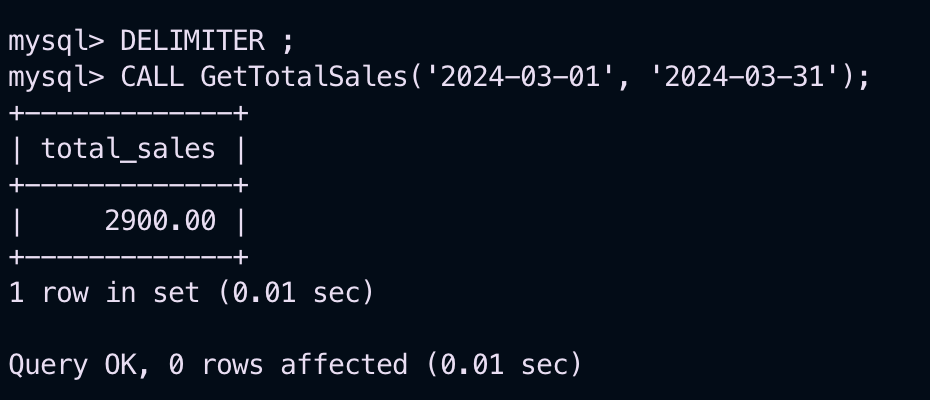
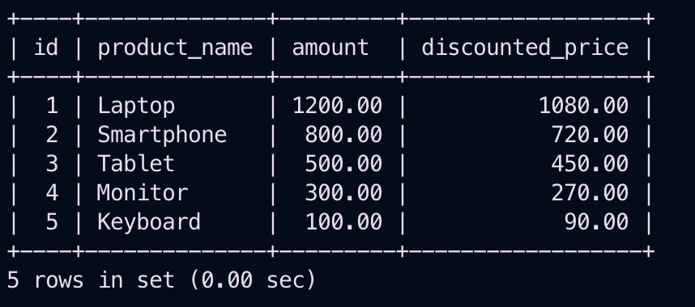

## Step 1: Creating the `Sales` Table
We will create a `Sales` table to store sales transactions.

```sql
CREATE TABLE Sales (
    id INT PRIMARY KEY AUTO_INCREMENT,
    product_name VARCHAR(100) NOT NULL,
    sale_date DATE NOT NULL,
    amount DECIMAL(10,2) NOT NULL
);
```

---

## Step 2: Inserting Sample Data
```sql
INSERT INTO Sales (product_name, sale_date, amount) VALUES
('Laptop', '2024-03-01', 1200.00),
('Smartphone', '2024-03-05', 800.00),
('Tablet', '2024-03-10', 500.00),
('Monitor', '2024-03-15', 300.00),
('Keyboard', '2024-03-20', 100.00);
```

---

## Step 3: Creating a Stored Procedure
A stored procedure to calculate total sales within a given date range.

```sql
DELIMITER //
CREATE PROCEDURE GetTotalSales(IN start_date DATE, IN end_date DATE)
BEGIN
    SELECT SUM(amount) AS total_sales FROM Sales
    WHERE sale_date BETWEEN start_date AND end_date;
END //
DELIMITER ;
```

### **Executing the Stored Procedure**
```sql
CALL GetTotalSales('2024-03-01', '2024-03-31');
```

**Explanation:**
- The procedure `GetTotalSales` accepts `start_date` and `end_date` as input parameters.
- It calculates the total sales amount within that range.

---

## Output
  

## Step 4: Creating a User-Defined Function (UDF)
A function to apply a discount on sales amount.

```sql
DELIMITER //
CREATE FUNCTION ApplyDiscount(amount DECIMAL(10,2), discount_percentage INT)
RETURNS DECIMAL(10,2)
DETERMINISTIC
BEGIN
    RETURN amount - (amount * discount_percentage / 100);
END //
DELIMITER ;
```

### **Using the Function in a Query**
```sql
SELECT id, product_name, amount,
       ApplyDiscount(amount, 10) AS discounted_price
FROM Sales;
```

**Explanation:**
- The function `ApplyDiscount` takes `amount` and `discount_percentage` as parameters.
- It calculates the discounted price by subtracting the discount amount from the original amount.

---

## Output
  

## Summary Table
| Feature | Stored Procedure | User-Defined Function |
|---------|----------------|----------------------|
| Purpose | Encapsulates business logic | Returns a single value or a table |
| Accepts Parameters | Yes | Yes |
| Returns Multiple Rows | Yes | Only in table-valued UDFs |
| Can Modify Data | Yes | No |

---


