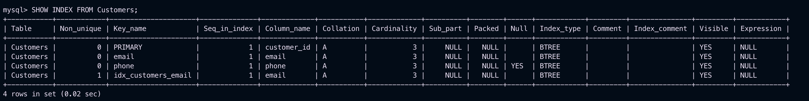

## **1. Database Schema Design**
The schema consists of multiple related tables, ensuring **normalization** and enforcing constraints like **primary keys (PK)**, **foreign keys (FK)**, **unique constraints**, and **CHECK constraints** where applicable.

### **1.1 Schema Structure**
```sql
CREATE TABLE Customers (
    customer_id INT PRIMARY KEY AUTO_INCREMENT,
    name VARCHAR(100) NOT NULL,
    email VARCHAR(100) UNIQUE NOT NULL,
    phone VARCHAR(15) UNIQUE,
    address TEXT,
    created_at TIMESTAMP DEFAULT CURRENT_TIMESTAMP
);

CREATE TABLE Products (
    product_id INT PRIMARY KEY AUTO_INCREMENT,
    name VARCHAR(100) NOT NULL,
    price DECIMAL(10,2) NOT NULL CHECK (price > 0),
    stock INT NOT NULL CHECK (stock >= 0),
    created_at TIMESTAMP DEFAULT CURRENT_TIMESTAMP
);

CREATE TABLE Orders (
    order_id INT PRIMARY KEY AUTO_INCREMENT,
    customer_id INT NOT NULL,
    order_date TIMESTAMP DEFAULT CURRENT_TIMESTAMP,
    total_amount DECIMAL(10,2) NOT NULL CHECK (total_amount >= 0),
    status ENUM('Pending', 'Shipped', 'Delivered', 'Cancelled') DEFAULT 'Pending',
    FOREIGN KEY (customer_id) REFERENCES Customers(customer_id)
);

CREATE TABLE OrderDetails (
    order_detail_id INT PRIMARY KEY AUTO_INCREMENT,
    order_id INT NOT NULL,
    product_id INT NOT NULL,
    quantity INT NOT NULL CHECK (quantity > 0),
    price DECIMAL(10,2) NOT NULL CHECK (price >= 0),
    FOREIGN KEY (order_id) REFERENCES Orders(order_id),
    FOREIGN KEY (product_id) REFERENCES Products(product_id)
);
```

---
## **2. Inserting Sample Data**
```sql
INSERT INTO Customers (name, email, phone, address) VALUES
('Alice Johnson', 'alice@example.com', '1234567890', '123 Main St, NY'),
('Bob Smith', 'bob@example.com', '9876543210', '456 Park Ave, LA'),
('Charlie Brown', 'charlie@example.com', '5556667777', '789 Elm St, TX');

INSERT INTO Products (name, price, stock) VALUES
('Laptop', 1200.00, 10),
('Smartphone', 800.00, 20),
('Tablet', 500.00, 15),
('Monitor', 300.00, 12),
('Keyboard', 50.00, 50);

INSERT INTO Orders (customer_id, total_amount, status) VALUES
(1, 1300.00, 'Pending'),
(2, 800.00, 'Shipped'),
(3, 550.00, 'Delivered');

INSERT INTO OrderDetails (order_id, product_id, quantity, price) VALUES
(1, 1, 1, 1200.00),
(1, 5, 2, 50.00),
(2, 2, 1, 800.00),
(3, 3, 1, 500.00),
(3, 5, 1, 50.00);
```

---
## **3. Indexing and Performance Optimization**
Indexes improve query speed, especially for large datasets.

```sql
CREATE INDEX idx_customers_email ON Customers(email);
CREATE INDEX idx_orders_customer_id ON Orders(customer_id);
CREATE INDEX idx_orderdetails_order_id ON OrderDetails(order_id);
CREATE INDEX idx_products_name ON Products(name);
```

- **Indexes on frequently searched columns** (e.g., `email`, `customer_id`, `name`).
- **Foreign keys are indexed by default**, improving JOIN performance.
- Consider **covering indexes** for specific queries if needed.

---
## **4. Triggers for Business Rules**
Automatically update inventory when an order is placed.

```sql
DELIMITER //
CREATE TRIGGER after_order_insert
AFTER INSERT ON OrderDetails
FOR EACH ROW
BEGIN
    UPDATE Products
    SET stock = stock - NEW.quantity
    WHERE product_id = NEW.product_id;
END //
DELIMITER ;
```

- **Prevents negative stock levels** by reducing inventory on new order insertion.
- Can be extended to **log order changes**.

---
## **5. Transactions for Data Consistency**
Ensuring orders are processed correctly using transactions.

```sql
START TRANSACTION;

INSERT INTO Orders (customer_id, total_amount, status) VALUES (1, 100.00, 'Pending');
SET @order_id = LAST_INSERT_ID();

INSERT INTO OrderDetails (order_id, product_id, quantity, price) VALUES (@order_id, 2, 1, 50.00);
INSERT INTO OrderDetails (order_id, product_id, quantity, price) VALUES (@order_id, 3, 1, 50.00);

COMMIT;
```

- If any **step fails**, use `ROLLBACK;` to **prevent incomplete orders**.
- **Ensures atomicity**, so all operations succeed or none at all.

---
## **6. Views for Simplifying Queries**
Create a view to easily fetch order summaries.

```sql
CREATE VIEW OrderSummary AS
SELECT o.order_id, c.name AS customer_name, o.order_date, o.total_amount, o.status
FROM Orders o
JOIN Customers c ON o.customer_id = c.customer_id;
```

### **Using the View**
```sql
SELECT * FROM OrderSummary WHERE status = 'Pending';
```

- Views **simplify complex joins** and improve readability.
- Can be used for **reporting dashboards**.

---
## **7. Testing and Validation**
### **Test Queries**
```sql

SHOW INDEX FROM Customers;


INSERT INTO OrderDetails (order_id, product_id, quantity, price) VALUES (1, 2, 5, 100.00);
SELECT stock FROM Products WHERE product_id = 2;


START TRANSACTION;
INSERT INTO Orders (customer_id, total_amount, status) VALUES (5, 250.00, 'Pending');
ROLLBACK;
SELECT * FROM Orders WHERE customer_id = 5; 
```
## Output


## Output


## Output


## Output
  

---
## **Conclusion**

- **Normalization** to eliminate redundancy.
- **Indexing** to improve performance.
- **Triggers** for business rule automation.
- **Transactions** for data integrity.
- **Views and materialized views** to simplify query operations.


